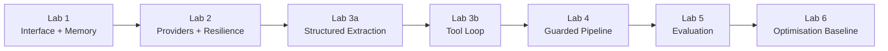

# Technical Documentation

## 1. Purpose

The project demonstrates core LLM application-engineering patterns through a sequence of training labs. The scenario is a sustainability-engineering assistant for THE LINE, with examples centered on energy, water, materials, and smart infrastructure. The implementation is educational and uses simulated providers, responses, costs, and latency rather than production services.

## 2. Architecture progression

## 3. Lab details

### Lab 1 — LLM skeleton

Defines request and response data structures, a common client protocol, a simulated compatible client, conversation state, an eight-turn history window, and a context-budget example. The purpose is to establish a small interface that later labs can reuse conceptually.

### Lab 2 — Two providers, one interface

Uses the same request structure with simulated OpenAI-compatible and Anthropic-style adapters. It demonstrates routing, streaming/TTFT behavior, retry and fallback logic, and a small latency benchmark. No real provider call is made.

### Lab 3a — Structured extraction

Uses a Pydantic model to turn unstructured engineering requests into validated fields. The lab demonstrates accepted values, validation errors, one repair attempt, and escalation when a valid result cannot be produced.

### Lab 3b — Tool loop

Defines three tools with risk labels: read-only, side-effecting, and terminal. An authorization gate protects the side-effecting booking action. A bounded loop limits tool iterations and includes negative tests for unknown tools, unauthorized users, and wrong arguments. The current authorized training user is Awadh.

### Lab 4 — Guarded pipeline

Builds an input/output safety path around the demo model. It checks scope and blocked phrases, masks training PII patterns, checks output for a demo secret, then runs attack tests. The final repair adds appointment wording to the accepted scope.

### Lab 5 — Evaluation harness

Defines a four-case golden set, a baseline answer version, a degraded answer version, a deterministic evaluator, a simple judge, and a regression gate. The 20% figure is a demo evaluation target only; it is not presented as an official THE LINE requirement.

### Lab 6 — Optimisation

Replays repeated engineering requests and measures simulated cost and latency. A simple router sends messages containing complex terms to a flagship model and other requests to a cheap model. In the supervisor-provided Lab 6 source, the exercise ends after establishing the `before` baseline; this repository does not invent an additional optimisation stage beyond that source.

## 4. Data and privacy

All IDs, phone numbers, application references, costs, latency values, secret codes, and evaluation targets in the notebooks are synthetic training data. The notebooks do not access live NEOM systems, personal databases, or production APIs.

## 5. Security concepts demonstrated

Lab 3b separates read-only and side-effecting tools and applies a basic authorization check before side effects. Lab 4 checks for prompt-injection phrases, restricts scope, masks selected PII formats, and blocks output containing a training secret. These examples are demonstrations and are not a complete production security design.

## 6. Evaluation and limitations

The evaluation harness uses substring matching rather than semantic evaluation. Provider behavior is mocked. Token counting uses whitespace splitting rather than a provider tokenizer. Latency and price values are fixed demo values. These choices keep the code aligned with the training labs and easy to run in Colab.

## 7. Running the project

Run each notebook independently in Google Colab using **Runtime → Run all**, in numerical order. Python standard-library modules cover most labs. Lab 3a requires Pydantic v2, listed in `requirements.txt`.

## 8. Project context

The project scenario is inspired by THE LINE and its sustainability and innovation themes. It is an independent educational exercise created for the training program and does not claim official affiliation, endorsement, or access to NEOM or THE LINE systems.
